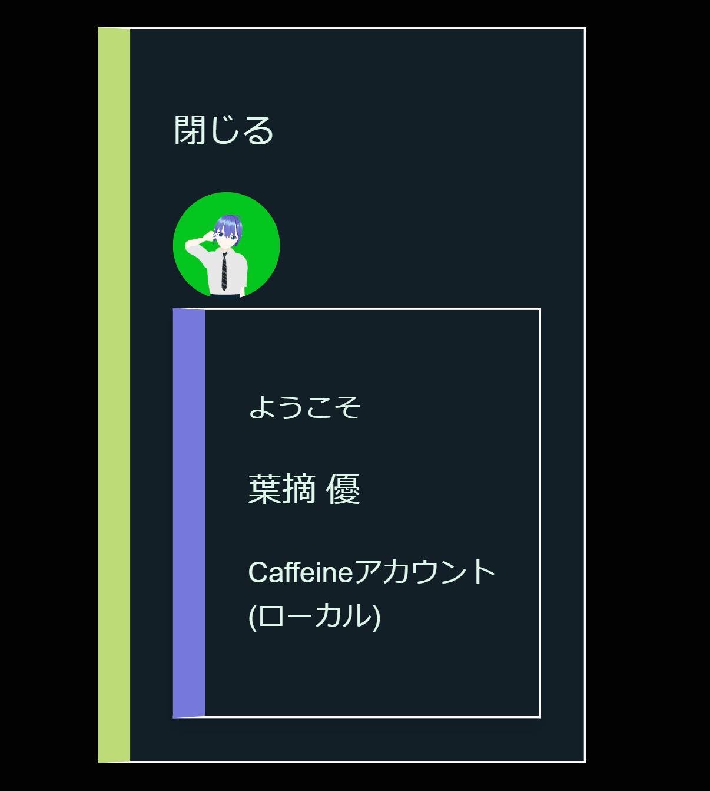

# Account_System_Integration_Script
[J]普通の静的サイトにローカルストレージフル活用でアカウントシステムのようなものを実装できるスクリプト  
独創性の暴走によって出来上がったスクリプトです。 静的サイトでもアカウントシステムが作りたい! そんなわがままを出来るだけ実現させるべく、製作しました。(...????)  
## What is this?  
ローカルストレージに保存されたユーザー名データと画像データを読み出し、表示します。(登録作業はこのスクリプトでは行えません。)  
どんなサイトでも動くとは限らないので、[J]なコード(ジャンク)です!  
ここから入手する場合はMITライセンス、CaffeineAppsのリポジトリから入手する場合横茶横葉Bライセンスが適用されます。  
## 例  

実装例  
(CaffeineファミリーのCSS[CaffeineCSS or FSLinear]を同時に御利用下さい。クラスはGとなっています。)  
```kore.html
<div class="G" style="position: absolute; top: 15vh; right: 5px;" id="accountdetails">
        <p onclick="closeaccountdiv()" id="asis1">閉じる</p>
        <a href="https://caffeineapps.pages.dev/account" target="_blank"></a>
        <div class="I" id="dropdownarea">
        <p><span id="username" id="asis2">User</span></p>
        <p><small id="asis3">ローカルアカウント</small></p>
        
        </div>
    </div>
```
閉じるボタン(テキスト)を押すと、このdiv全体が非表示になります。  
